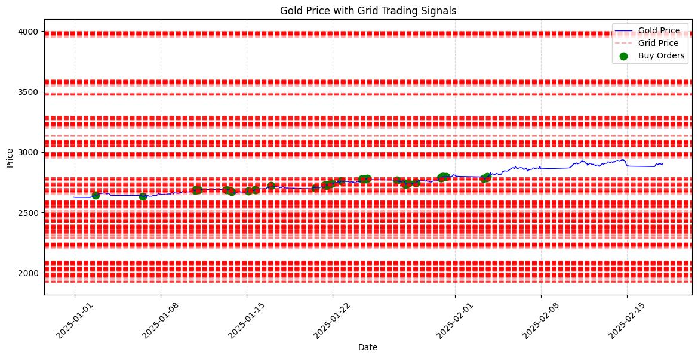
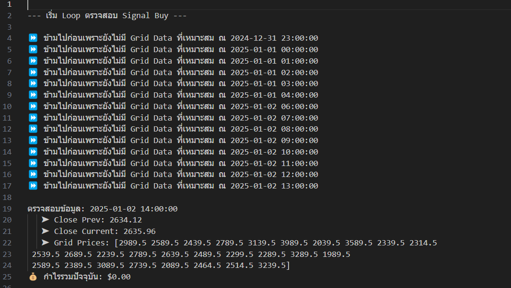
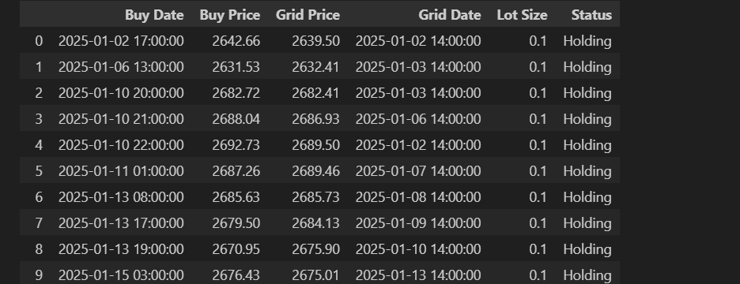
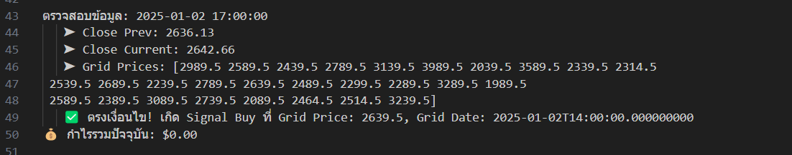
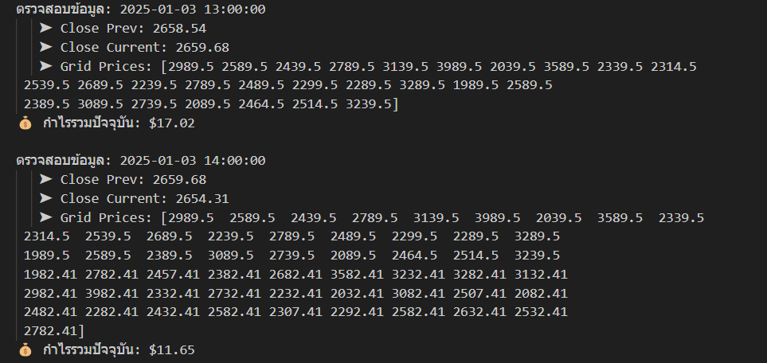
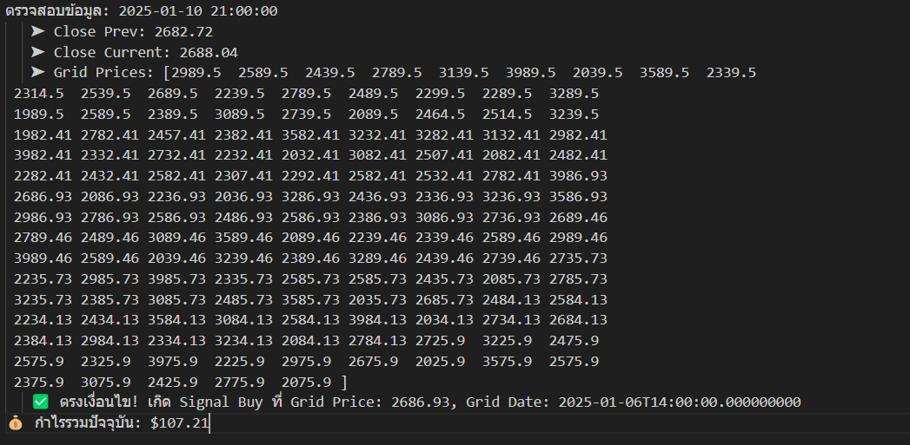
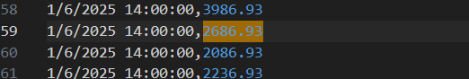
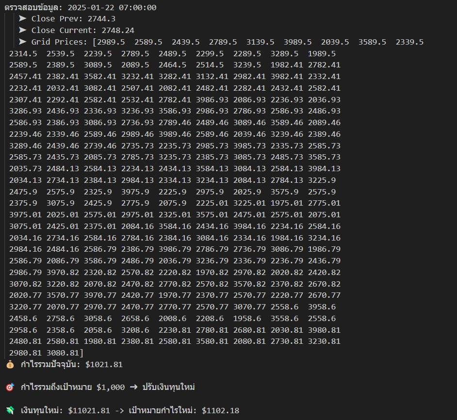
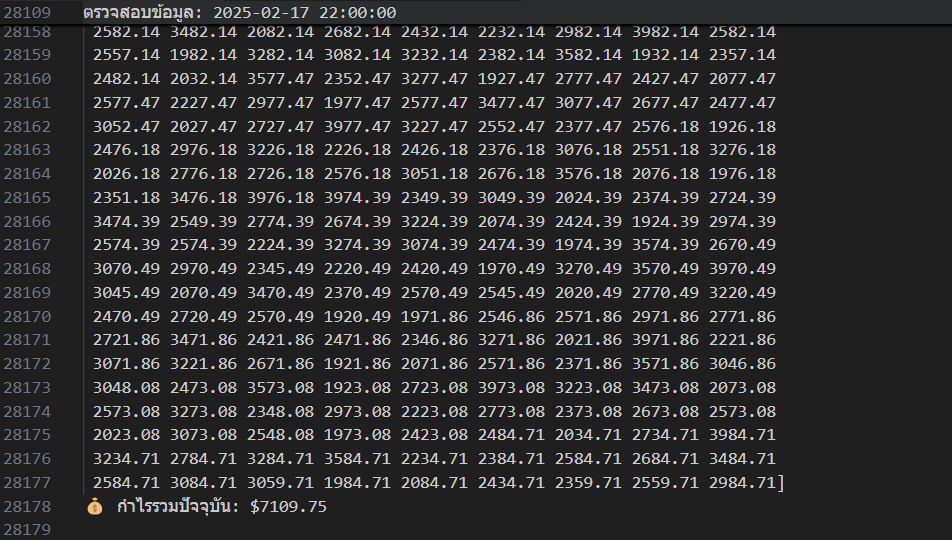

# 📊 Grid Trading สำหรับราคาทองคำ (Gold)
<p align="center">
  
</p>
โค้ดนี้เป็นกลยุทธ์ Grid Trading สำหรับราคาทองคำ (XAUUSD) โดยใช้ข้อมูลราคาจริงและ Grid Price เพื่อวิเคราะห์และทำการซื้อ (Buy) เมื่อราคาแตะ Grid Price ที่กำหนด

## 🚀 ฟีเจอร์หลัก
- ตรวจสอบ Signal Buy เมื่อราคาทองคำแตะ Grid Price
- บันทึกคำสั่งซื้อ (Buy Orders) พร้อมรายละเอียด
- คำนวณกำไรรวม และปรับเป้าหมายกำไรเมื่อถึงเป้า
- แสดงผลกราฟราคาทองคำ, Grid Price และจุดซื้อ (Buy Orders)

---

## ⚙️ การติดตั้งและการใช้งาน

1. **ติดตั้งไลบรารีที่จำเป็น**
```bash
pip install pandas matplotlib
```

2. **เตรียมไฟล์ข้อมูลราคาทองคำและ Grid Price**
- `mt5_data_XAUUSD_TF1H_jan_TH.csv`: ไฟล์ราคาทองคำ (XAUUSD) ที่ใช้เป็นข้อมูลเข้า
- `pricegrid_2mount.ipynb_reordered.csv`: ไฟล์ Grid Price สำหรับใช้ในการตรวจสอบ Signal Buy

3. **รันโค้ด**
```bash
python grid_trading_gold.py
```

---

## 📈 อธิบายการทำงานของโค้ดแบบละเอียด

### 1. **ตั้งค่าพารามิเตอร์การเทรด**
- เริ่มต้นด้วยการกำหนดเงินทุนเริ่มต้น (`capital`), เลเวอเรจ (`leverage`), ขนาด Lot (`lot_size`), ราคาของ 1 Pip (`pip_value`)
- กำหนดเป้าหมายกำไร (`target_profit`) เป็น 10% ของเงินทุน

### 2. **โหลดและเตรียมข้อมูล**
- ใช้ Pandas ในการโหลดข้อมูลราคาทองคำและ Grid Price จากไฟล์ CSV
- แปลงคอลัมน์วันที่ (`Date`) ให้เป็นรูปแบบ datetime และลบค่าที่เป็น NaN

### 3. **ตรวจสอบ Signal Buy และบันทึกคำสั่งซื้อ**
- รันลูปตรวจสอบราคาปิด (`Close`) ของทองคำเปรียบเทียบกับ `GridPrice`
- ถ้าราคาปัจจุบันแตะ Grid Price ใด จะบันทึกคำสั่งซื้อโดยเก็บข้อมูลวันที่, ราคาซื้อ, Grid Price, ขนาด Lot และสถานะ
- ลบ Grid Price ที่ถูกใช้ออกจาก DataFrame เพื่อลดการซ้ำซ้อน

### 4. **คำนวณกำไรรวมและปรับเป้าหมายกำไร**
- คำนวณกำไรแต่ละคำสั่งซื้อ (Buy Order) โดยใช้สูตร `(ราคาปัจจุบัน - ราคาซื้อ) * Lot Size * (1 / Pip Value)`
- หากกำไรรวมถึงเป้าหมาย $1,000 จะเพิ่มกำไรเข้าไปในเงินทุนและคำนวณเป้าหมายกำไรใหม่เป็น 10% ของเงินทุนปัจจุบัน

### 5. **แสดงผลกราฟ**
- ใช้ Matplotlib ในการ Plot กราฟราคาทองคำ (เส้นสีน้ำเงิน), Grid Price (เส้นประสีแดง) และตำแหน่งคำสั่งซื้อ (จุดสีเขียว)
- เพิ่มชื่อกราฟ (`title`), ชื่อแกน (`xlabel`, `ylabel`), และตั้งค่า grid ให้ดูง่ายขึ้น

---

## 🔍 ตรวจสอบการทำงานของโค้ดผ่าน Log และ Signal

### 📝 ตัวอย่างการตรวจสอบผ่าน Log
<p align="center">
  
</p>
จาก Log จะเห็นว่าก่อนหน้าที่ไม่มีข้อมูล `GridPrice` จะไม่มีการทำงานเกิดขึ้น

### 💡 การเกิด Signal Buy และการลบ Grid Price
<p align="center">
  
</p>
เมื่อเกิด Signal ที่ราคาใด จะทำการลบ `GridPrice` เวลานั้น ๆ ออก

### 📅 ตัวอย่าง Signal แรก
<p align="center">
  
</p>
Signal แรกเกิดขึ้นเมื่อวันที่ `2025-01-02 17:00:00`

### 📈 การอัปเดต Grid Price รายวัน
<p align="center">
  
</p>
Grid Price จะถูกอัปเดตทุกบ่าย 2 โมงของทุกวัน ทำให้ `GridPrice` ใน array เพิ่มขึ้น

### 🔍 ตรวจสอบความถูกต้องของ Grid Price
<p align="center">
  
</p>
เช็คการทำงานของ `GridPrice` โดยดู Signal ที่ index ที่ 3 จะพบ Signal วันที่ `2025-01-10 21:00:00`

### 🗂️ การตรวจสอบข้อมูลจาก CSV
<p align="center">
  
</p>
พบว่า Grid Price `2686.93` ตรงกับวันที่ `1/6/2025 14:00:00` ซึ่งข้อมูลถูกต้อง

### 💹 กำไรระหว่างการทำงาน
<p align="center">
  
</p>
โปรแกรมยังคงทำงานต่อเนื่องเพื่อหากำไรเพิ่มเติม

### 🏁 ผลลัพธ์สุดท้ายก่อนหมดข้อมูลทดสอบ
<p align="center">
  
</p>
สรุปผลกำไรสุดท้ายเมื่อข้อมูลทดสอบสิ้นสุด

---

## 📝 หมายเหตุ
- โค้ดนี้เหมาะสำหรับการทดสอบกลยุทธ์ (Backtest) เท่านั้น
- การลงทุนมีความเสี่ยง ผู้ใช้ควรศึกษาข้อมูลเพิ่มเติมก่อนการลงทุนจริง

